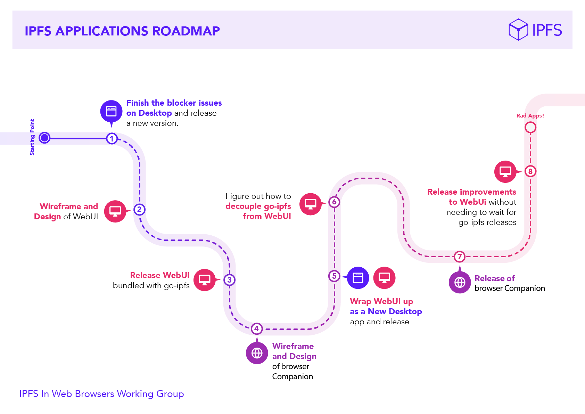

# The IPFS User Interface Project

> Make the IPFS GUIs simple, accessible, reusable and beautiful. That is the IPFS GUI Team! 

## Goal

Make the IPFS GUIs simple, accessible, reusable and beautiful.

## Process

- [Research and document](research/README.md) the existing IPFS apps: IPFS WebUI, Desktop & Companion.
- Create a [list of existing features](https://github.com/ipfs-shipyard/pm-ipfs-gui/issues?q=is%3Aissue+is%3Aopen+label%3A%22existing+feature%22) and define the ideal way to offer up each concept to the users. `<--` **WIP**
- Define the [purpose and scope of each app](https://github.com/ipfs-shipyard/pm-ipfs-gui/issues/41).
- Document the implementation roadmap (see below)
- Create wireframes for new apps `<--` **we are here**
- Build them!



We want to make IPFS GUIs simple, accessible, reusable and beautiful. To do this, we’ll gather together a list of the features that appear in Desktop, Companion and WebUI, compare their implementations, and find consensus on the ideal way to offer up each concept to the users.

With that list agreed, we’ll then **define the purpose and scope of each app**, and how it’s feature set integrates with the other apps. We don’t want each app to duplicate the entire feature set of the others, but each app should have enough functionality to be useful in isolation. Each app has to work within different constraints. A desktop app has greater freedom in its implementation than a browser WebExtension. We’ll optimise each app to make best use of the resources available.

From there, we’ll design wireframes for each app, composing them from the list of ideal features, finding the UI/UX patterns that can be reproduced across the differing deployment environments. The goal here is not to force each app to be identical, but to come up with a common visual language, where the same feature looks familiar and behaves in a predictable way across all the apps, while the overall layout will be adapted to work best for the context. _The frame may change, but the buttons will work the same._

See the [IPFS GUI Project Description](https://docs.google.com/document/d/1HzwTYo4BDDH4WIh0EULh0U9_WnT84FacDUdVtTExluQ/edit?usp=sharing) document for the original definition of this project.

## The IPFS GUI Triangle

```

                              Webui
                                Λ
                               ╱ ╲
                              ╱   ╲
                             ╱     ╲
                            ╱       ╲
                           ╱         ╲
                          ╱           ╲
                         ╱             ╲
                        ╱               ╲
                       ╱                 ╲
                      ╱                   ╲
                     ╱┌ ─ ─ ─ ─ ─ ─ ─ ─ ─ ┐╲
                    ╱   IPFS GUI Triangle   ╲
                   ╱  └ ─ ─ ─ ─ ─ ─ ─ ─ ─ ┘  ╲
                  ╱                           ╲
                 ╱                             ╲
                ╱                               ╲
     Companion  ───────────────────────────────── Desktop
```


## Docs, Assets and Code

- PM
  - [Project Work Plan & Description](https://docs.google.com/document/d/1HzwTYo4BDDH4WIh0EULh0U9_WnT84FacDUdVtTExluQ/edit#heading=h.a415cvyt09h4)
  - [Main Google Drive folder](https://drive.google.com/drive/u/1/folders/1xu_lv1jsatKnwyFcjd_fDsg3rCi9550u)
  - [Research](research)

- Design
  - Assets in Google Drive (soon™)
  - Zeplin
    - [WebUI Wireframe](https://app.zeplin.io/project/5a32d45d1a17248135241058)
  - [Design Tools Research](https://docs.google.com/document/d/1qJyfwgcMg8l3Tk3aYxF38iyYRhkEf3nlLNqOw4ZiW_8/edit)

- Code
  - [webui](https://github.com/ipfs-shipyard/ipfs-webui)
  - [desktop](https://github.com/ipfs-shipyard/ipfs-desktop)
  - [companion](https://github.com/ipfs/ipfs-companion)
