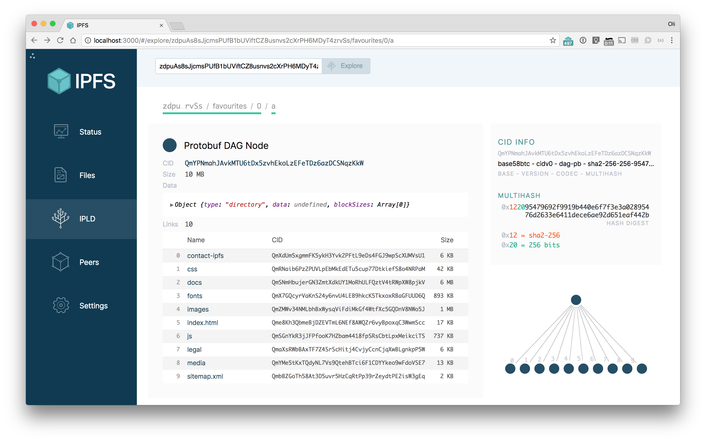
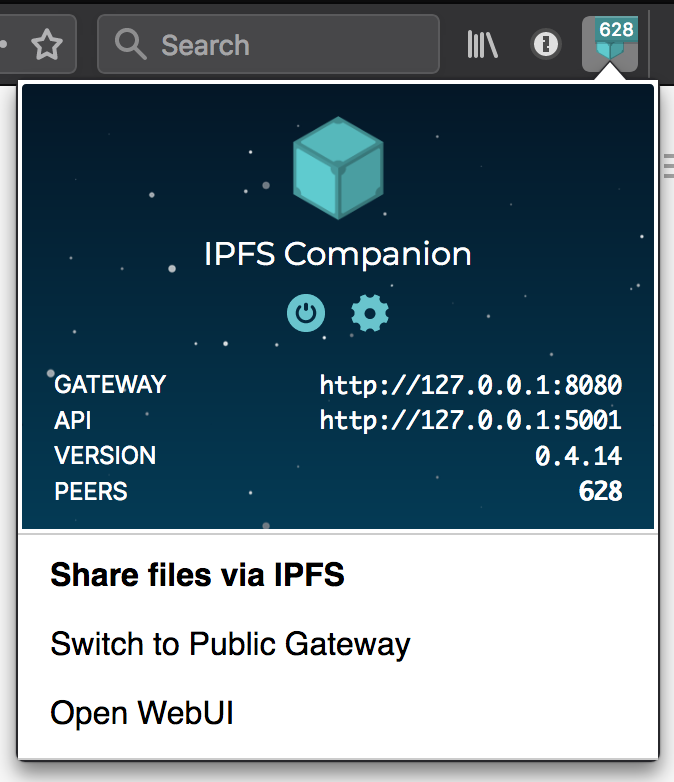

# The IPFS GUI group

Our goal is to **create visual and interaction standards and patterns for working with IPFS that are *simple*, *accessible*, *reusable*, and *beautiful*.**

- **Simple** - Fight complexity at every step. There are big ideas in IPFS. Let's present them clearly.
- **Accessible** - IPFS **must** be usable and comprehensible for everyone.
- **Reusable** - Publish and promote this work. Make doing the right thing the easiest thing.
- **Beautiful** - Demonstrate the nature of the system with effortless, coherent, and compelling interfaces.

## IPFS GUI projects

### Primary projects

- [IPFS Web UI] - Graphical IPFS file manager and network explorer.
- [IPFS Desktop] -  Launch and manage IPFS from your OS GUI.
- [IPFS Companion] - Give your browser IPFS super powers.

| Web UI        | Desktop        | Companion         |
|---------------|----------------|-------------------|
| [][IPFS Web UI] | [][IPFS Desktop] | [][IPFS Companion]

### All projects

In addition to the apps above, the IPFS GUI group supports work on issues in the following repos. You can get a birds-eye view on prioritization and progress of GUI-centric work in these repos in [our ZenHub board](https://app.zenhub.com/workspaces/-ipfs-app-family-ux-5e7a3123e969e659cdebb5e6/board?repos=111841602,32695583,36580101,24483721,142161410,119716282,116711586,38799513,142181521,147528357,148369983,40225364,104770273). *Note that our focus is primarily on UX-related work, so not all issues within all these repos may be in our group's purview.*

- [ipfs/ipfs-gui](https://www.github.com/ipfs/ipfs-gui) - This repo, used for overall planning and cross-repo work
- [ipfs/dir-index-html](https://www.github.com/ipfs/dir-index-html) - Directory listing HTML for go-ipfs gateways
- [ipfs/distributions](https://www.github.com/ipfs/distributions) - Source code for https://dist.ipfs.io
- [ipfs/i18n](https://www.github.com/ipfs/i18n) - Internationalization work across all IPFS projects
- [ipfs/public-gateway-checker](https://www.github.com/ipfs/public-gateway-checker) - Source code for https://ipfs.github.io/public-gateway-checker/
- [ipfs-shipyard/ipfs-companion](https://www.github.com/ipfs-shipyard/ipfs-companion) - Browser extension that simplifies access to IPFS resources on the Web
- [ipfs-shipyard/ipfs-css](https://www.github.com/ipfs-shipyard/ipfs-css) - Single-purpose CSS rules and font-face config to add the IPFS look and feel to your UI
- [ipfs-shipyard/ipfs-desktop](https://www.github.com/ipfs-shipyard/ipfs-desktop) - An unobtrusive and user-friendly desktop application for IPFS on Windows, Mac and Linux
- [ipfs-shipyard/ipfs-share-files](https://www.github.com/ipfs-shipyard/ipfs-share-files) - Source code for https://share.ipfs.io
- [ipfs-shipyard/ipfs-ui-style-guide](https://www.github.com/ipfs-shipyard/ipfs-ui-style-guide) - UI style guide for IPFS apps
- [ipfs-shipyard/ipfs-webui](https://www.github.com/ipfs-shipyard/ipfs-webui) - Browser front-end for IPFS nodes
- [ipfs-shipyard/ipld-explorer](https://www.github.com/ipfs-shipyard/ipld-explorer) - Source code for https://explore.ipld.io
- [ipfs-shipyard/ipld-explorer-components](https://www.github.com/ipfs-shipyard/ipld-explorer-components) - React components for https://explore.ipld.io

## Status

We are focused on rebuilding and shipping the new [IPFS Web UI].

Once that is shipped we will be extracting what we have learned into a UI guidebook and a reusable component library. Then we'll be using those components to develop the next iteration of [IPFS Desktop] and [IPFS Companion].

## Process

- [Research and document](research/README.md) the existing IPFS apps: IPFS Web UI, Desktop & Companion.
- Create a [list of existing features](https://github.com/ipfs-shipyard/pm-ipfs-gui/issues?q=is%3Aissue+is%3Aopen+label%3A%22existing+feature%22) and define the ideal way to offer up each concept to the users.
- Define the [purpose and scope of each app](https://github.com/ipfs-shipyard/pm-ipfs-gui/issues/41).
- Document the implementation roadmap (see below)
- Create [wireframes](https://projects.invisionapp.com/d/main#/projects/prototypes/13924274) for new apps
- [Build them!](https://github.com/ipfs-shipyard/ipfs-webui/tree/revamp)

We want to make IPFS GUIs simple, accessible, reusable and beautiful. To do this, we’ll gather together a list of the features that appear in Desktop, Companion and WebUI, compare their implementations, and find consensus on the ideal way to offer up each concept to the users.

With that list agreed, we’ll then **define the purpose and scope of each app**, and how it’s feature set integrates with the other apps. We don’t want each app to duplicate the entire feature set of the others, but each app should have enough functionality to be useful in isolation. Each app has to work within different constraints. A desktop app has greater freedom in its implementation than a browser WebExtension. We’ll optimise each app to make best use of the resources available.

From there, we’ll design wireframes for each app, composing them from the list of ideal features, finding the UI/UX patterns that can be reproduced across the differing deployment environments. The goal here is not to force each app to be identical, but to come up with a common visual language, where the same feature looks familiar and behaves in a predictable way across all the apps, while the overall layout will be adapted to work best for the context. _The frame may change, but the buttons will work the same._

See the [IPFS GUI Project Description](https://docs.google.com/document/d/1HzwTYo4BDDH4WIh0EULh0U9_WnT84FacDUdVtTExluQ/edit?usp=sharing) document for the original definition of this project.

## Resources

#### Assets
  - IPFS Logo - [repo](https://github.com/ipfs/logo) - _vector and raster logo assets_
  - IPFS brand book - [_pdf_](https://github.com/ipfs-shipyard/ipfs-ui-style-guide/files/1629262/IPFS_brandbook.pdf) - _how to use the IPFS logo_
  - IPFS UI kit - [_png_](img/ipfs-ui-kit.png) - _wip on a UI style guide_
  - Web UI Wireframes - [_invision_](https://app.zeplin.io/project/5a32d45d1a17248135241058)
  - Design Tools Research - [google doc](https://docs.google.com/document/d/1qJyfwgcMg8l3Tk3aYxF38iyYRhkEf3nlLNqOw4ZiW_8/edit)
  - [IPFS color palette](resources/color-palette.md) in a bunch of formats

#### PM

  - [Project Work Plan & Description](https://docs.google.com/document/d/1HzwTYo4BDDH4WIh0EULh0U9_WnT84FacDUdVtTExluQ/edit#heading=h.a415cvyt09h4)
  - [Main Google Drive folder](https://drive.google.com/drive/u/1/folders/1xu_lv1jsatKnwyFcjd_fDsg3rCi9550u)
  - [Research](research)

## Team

In alphabetical order we are:

- @akrych - UI designer and the Protocol illustration master
- @alanshaw - Web UI & Companion dev - the `window.ipfs` wizard
- @fsdiogo - Web UI & Companion dev - he fights for the users
- @hacdias - Desktop lead dev and Web UI - the file manager mage
- @jessicaschilling - UX strategist
- @lidel - Companion lead dev and original IPFS sage
- @olizilla - Web UI lead dev and GUI team gardener

**and you...**

## Contributing

We figure things out in the open and coordinate via the [**issues on this repo**](https://github.com/ipfs/ipfs-gui/issues). You can **chat with us in irc** in the <a href="https://www.irccloud.com/invite?channel=%23ipfs-gui&amp;hostname=irc.freenode.net&amp;port=6697&amp;ssl=1"> #ipfs-gui channel on irc.freenode.net</a>. We're an open project and a friendly group, so be nice and **read the [contributing guidelines](https://github.com/ipfs/community/blob/master/CONTRIBUTING_JS.md)** when you're ready to jump in.

[IPFS Web UI]: https://github.com/ipfs-shipyard/ipfs-webui "Graphical IPFS file manager and network explorer"
[IPFS Desktop]: https://github.com/ipfs-shipyard/ipfs-desktop "Launch and manage IPFS from your OS GUI"
[IPFS Companion]: https://github.com/ipfs/ipfs-companion "Integrate IPFS with your browser"
[IPFS CSS]: https://github.com/ipfs-shipyard/ipfs-css "The single-purpose css class names and font-face config to IPFS up your UI."
