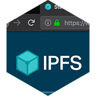

# The IPFS GUI group

Our goal is to **create visual and interaction standards and patterns for working with IPFS that are ...**

- **Simple**: Present the big ideas of IPFS clearly, without unnecessary complexity
- **Accessible**: Enable *everyone* to take advantage of what IPFS offers
- **Reusable**: Offer compelling standards and atomic patterns to the community of IPFS builders
- **Beautiful**: By their nature, things that are simple, accessible and reusable are also beautiful

## IPFS GUI projects

### Primary projects

Our primary focus is on the three Protocol Labs-led "helper" apps that provide a GUI for IPFS as a whole. Our aim is to make them useful for seasoned IPFS developers while also offering a welcoming introduction to IPFS for those less experienced.

| IPFS Companion | IPFS WebUI | IPFS Desktop |
|:-:|:-:|:-:|
| [][IPFS Companion] | [][IPFS Web UI] | [][IPFS Desktop] |
| [Browser extension](https://github.com/ipfs/ipfs-companion) for opening ipfs:// URLs, saving/sharing files, and more| [IPFS file manager and network explorer](https://github.com/ipfs-shipyard/ipfs-webui) in your browser | Launch and manage IPFS from a friendly, intuitive [desktop app](https://www.github.com/ipfs-shipyard/ipfs-desktop) |

### All projects

In addition to the apps above, the IPFS GUI group supports work on issues in all of the following repos. You can get a birds-eye view on prioritization and progress of GUI-centric work in these repos in [our ZenHub board](https://app.zenhub.com/workspaces/-ipfs-app-family-ux-5e7a3123e969e659cdebb5e6/board?repos=111841602,32695583,36580101,24483721,142161410,119716282,116711586,38799513,142181521,147528357,148369983,40225364,104770273). *Note that our focus is primarily on UX-related work, so not all issues within all these repos may be in our group's purview.*

- **[ipfs/ipfs-gui](https://www.github.com/ipfs/ipfs-gui)**: This repo, used for overall planning and cross-repo work
- **[ipfs/dir-index-html](https://www.github.com/ipfs/dir-index-html)**: Directory listing HTML for go-ipfs gateways
- **[ipfs/distributions](https://www.github.com/ipfs/distributions)**: Source code for https://dist.ipfs.io
- **[ipfs/i18n](https://www.github.com/ipfs/i18n)**: Internationalization work across all IPFS projects
- **[ipfs/public-gateway-checker](https://www.github.com/ipfs/public-gateway-checker)**: Source code for https://ipfs.github.io/public-gateway-checker/
- **[ipfs-shipyard/ipfs-companion](https://www.github.com/ipfs-shipyard/ipfs-companion)**: Browser extension that simplifies access to IPFS resources on the Web
- **[ipfs-shipyard/ipfs-css](https://www.github.com/ipfs-shipyard/ipfs-css)**: Single-purpose CSS rules and font-face config to add the IPFS look and feel to your UI
- **[ipfs-shipyard/ipfs-desktop](https://www.github.com/ipfs-shipyard/ipfs-desktop)**: An unobtrusive and user-friendly desktop application for IPFS on Windows, Mac and Linux
- **[ipfs-shipyard/ipfs-share-files](https://www.github.com/ipfs-shipyard/ipfs-share-files)**: Source code for https://share.ipfs.io
- **[ipfs-shipyard/ipfs-ui-style-guide](https://www.github.com/ipfs-shipyard/ipfs-ui-style-guide)**: UI style guide for IPFS apps
- **[ipfs-shipyard/ipfs-webui](https://www.github.com/ipfs-shipyard/ipfs-webui)**: Browser front-end for IPFS nodes
- **[ipfs-shipyard/ipld-explorer](https://www.github.com/ipfs-shipyard/ipld-explorer)**: Source code for https://explore.ipld.io
- **[ipfs-shipyard/ipld-explorer-components](https://www.github.com/ipfs-shipyard/ipld-explorer-components)**: React components for https://explore.ipld.io

## Q2 2020 update

### Motivation

After considerable focus in 2019 on core aspects of the IPFS protocol itself, we aim to bring refreshed attention back to our GUI-driven tools, because ...

- Establishing our app family as a unified suite via a consistent, feedback-driven user experience makes it easier for people to understand, use, and build on the IPFS protocol — regardless of the extent of their current IPFS expertise
- Establishing standards for high-quality mental models and visual metaphors for IPFS gives guidance and inspiration to other IPFS developers who are creating end-user interfaces themselves — without stealing their thunder or trying to do their job

We understand that this is a long-term approach, and intend to focus in Q2 2020 on the landscape analysis, issue consolidation and prioritization, and foundational work required to establish low-friction, consistent attention on our GUI-driven tools.

### Q2 2020 OKRs

As with every team within IPFS, the GUI group sets and adheres to quarterly OKRs (Objectives and Key Results) in order to guide our work. (You can see [all of the IPFS Project's quarterly OKRs here](https://docs.google.com/spreadsheets/d/1YTnvQ75v0jCuumOM9CPhx0BZHhJzZGy2u2ydU-rPh2w/edit#gid=2033312819).)

1. Establish a trackable, transparent home for app family work
    1. Repurpose the existing ipfs-gui repo as central home for family-wide UX/UI/product-strategy work; this includes consolidating any other repos that should collapse into this one
    2. Build an issue management framework in ZenHub consistent with our other project/product management practices (including [standard issue labeling](https://github.com/ipfs/community/blob/master/ISSUE_LABELS.md)); include all relevant repos
2. Evaluate the current state of the app family landscape by collecting, evaluating, and prioritizing existing issues
    1. Issue queues for all three apps and other related repos examined, ranked, consolidated/reframed as necessary, and clearly visible in ZenHub
    2. Issue queues used to determine short-term/long-term staffing needs in both design/UX and development
    3. Issue queues ready for use in evaluating the existing landscape for overall UX/UI discrepancies and pain points
3. Close *x* outstanding UX/UI-related issues in app family, where *x* is a number defined by overall staffing and workload during the quarter *(note: this is intentionally vague in a time of global pandemic, but we will hope for the best)*
4. Create [first-draft mental model](https://www.figma.com/proto/EDrHTYUhJTEa0GU8Q5zEDG/IPFS-app-family-Mental-model-dashboard?node-id=1%3A2&viewport=-4787%2C-325%2C0.6132321953773499&scaling=contain) of the IPFS app family, cross-referenced against core goals and identified stakeholders
    1. ~~If time allows,~~ Increase granularity of the model by adding basic user journeys cross-referenced against core goals and stakeholders
    2. ~~If time allows,~~ Augment with basic potential future journeys for “civilian” file sharing or other non-core-dev means of increasing the number of nodes online

## Get involved!

### Join a meeting

We'd love to meet you in person at one of our open meetings. They're a great way to get quickly up to speed on our work, including latest developments and awesome demos.

- **When:** Every other Tuesday at 16:30 UTC (check the [IPFS Calendar](https://calendar.google.com/calendar/embed?src=ipfs.io_eal36ugu5e75s207gfjcu0ae84@group.calendar.google.com&ctz=UTC) to see exact dates!)
- **Where:** https://protocol.zoom.us/j/833247793
- **Agenda**: https://hackmd.io/QaxiCU8BQqOuK8B8Tdi36g

You can also explore [recordings](https://www.youtube.com/playlist?list=PLuhRWgmPaHtRIXVTy_ngBwvsXvWw10mR8) and [notes](https://github.com/ipfs/team-mgmt/tree/master/meeting-notes) from past meetings any time.

### Contribute to an issue

Contributions to our work are more than welcome! The easiest way to see what issues are prioritized and on deck is to use our [unified public ZenHub board](https://app.zenhub.com/workspaces/-ipfs-app-family-ux-5e7a3123e969e659cdebb5e6/board?repos=111841602,32695583,36580101,24483721,142161410,119716282,116711586,38799513,142181521,147528357,148369983,40225364,104770273); our work hits a lot of repos, so having them in one place offers a good birds-eye view.

If you don't want to use ZenHub, that's cool too. Each of the repos listed under ["All projects"](#all-projects) above makes use of the IPFS Project's [global issue labeling scheme](https://github.com/ipfs/community/blob/master/ISSUE_LABELS.md). Good labels to look for are ...
- `help wanted`
- `good first issue`
- and there are even occasional `bounty` labels for issues with rewards as part of the [IPFS Bounty Board](https://github.com/ipfs/devgrants/projects/1)!

If you see an issue that catches your eye, leave a comment so we know you're interested, and we'll go from there!

We're an open project and a friendly group, so please be nice and **read the [contributing guidelines](https://github.com/ipfs/community/blob/master/CONTRIBUTING_JS.md)** when you're ready to jump in.

### Discuss in GitHub or IRC

We do hang out on IRC — see the <a href="https://www.irccloud.com/invite?channel=%23ipfs-gui&amp;hostname=irc.freenode.net&amp;port=6697&amp;ssl=1"> #ipfs-gui channel on irc.freenode.net</a> — but for the sake of async communication, archiving, and searchability, we encourage discussions to happen in the context of GitHub issue comments whenever practical.

## Resources

If you're just looking for high-level visual and brand info, these resources may be helpful.

- [IPFS Logo Files](https://github.com/ipfs/logo): Vector and raster logo assets
- [IPFS Brand Book](https://github.com/ipfs-shipyard/ipfs-ui-style-guide/files/1629262/IPFS_brandbook.pdf): IPFS-wide brand guidance, including logo guidelines
- [IPFS UI Summary](img/ipfs-ui-kit.png): Alpha-version UI style guide summary
- [IPFS color palette](resources/color-palette.md): Official IPFS colors, in assorted formats
- [Original GUI project research](research): Spring 2018 foundational research on IPFS GUIs, including the initial definition of this group's goals

## Maintainers

- [@alanshaw](https://github.com/alanshaw): WebUI and Companion dev
- [@hacdias](https://github.com/hacdias): Desktop lead dev and WebUI dev
- [@jessicaschilling](https://github.com/jessicaschilling): UX strategist and sometimes-PM
- [@lidel](https://github.com/lidel): Companion lead dev
- [@olizilla](https://github.com/olizilla): WebUI lead dev
- [@rafaelramalho19](https://github.com/rafaelramalho19): Front-end dev across all projects
- **... and you!**

[IPFS Web UI]: https://github.com/ipfs-shipyard/ipfs-webui "Web-based IPFS file manager and network explorer"
[IPFS Desktop]: https://github.com/ipfs-shipyard/ipfs-desktop "Launch and manage IPFS from a desktop app"
[IPFS Companion]: https://github.com/ipfs/ipfs-companion "Integrate IPFS with your browser"
